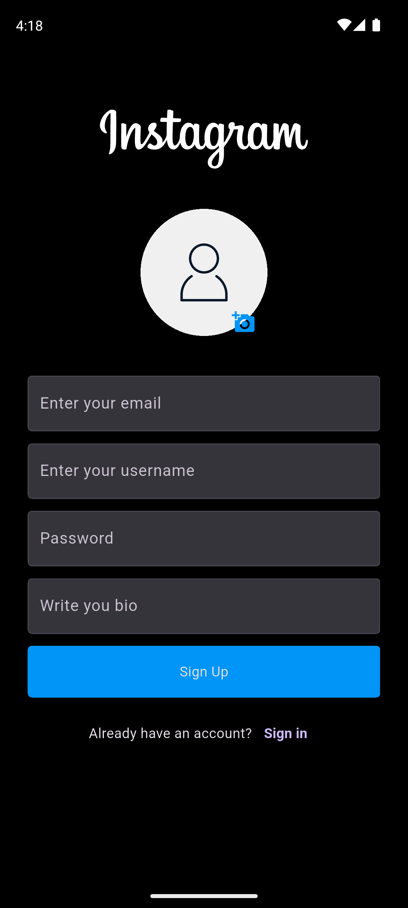

# Flutter Instagram Clone

A Flutter-based Instagram clone (education/demo).

## Features

- Feed, posts, likes, comments
- Login, SignUp, Edit Profile
- Firebase Auth + Firestore + Storage
- Responsive UI (Android, iOS, Web)

## Tech

- Flutter (stable), Dart
- Firebase (Auth, Firestore, Storage)
- Android Gradle Plugin 8.9.1, Kotlin 2.1.0, JDK 17

## Getting Started

1. `flutter pub get`
2. Add `android/app/google-services.json` and `ios/Runner/GoogleService-Info.plist`
3. `flutter run`

## Build

- APK: `flutter build apk --release`
- AAB: `flutter build appbundle --release`

## Screenshots

## Disclaimer

This is an educational project; “Instagram” is a trademark of its owner.
